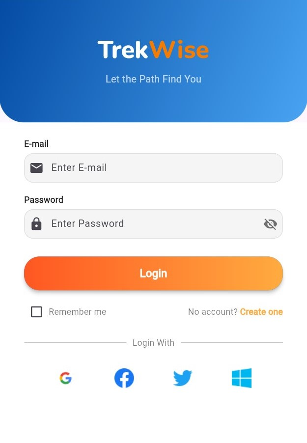
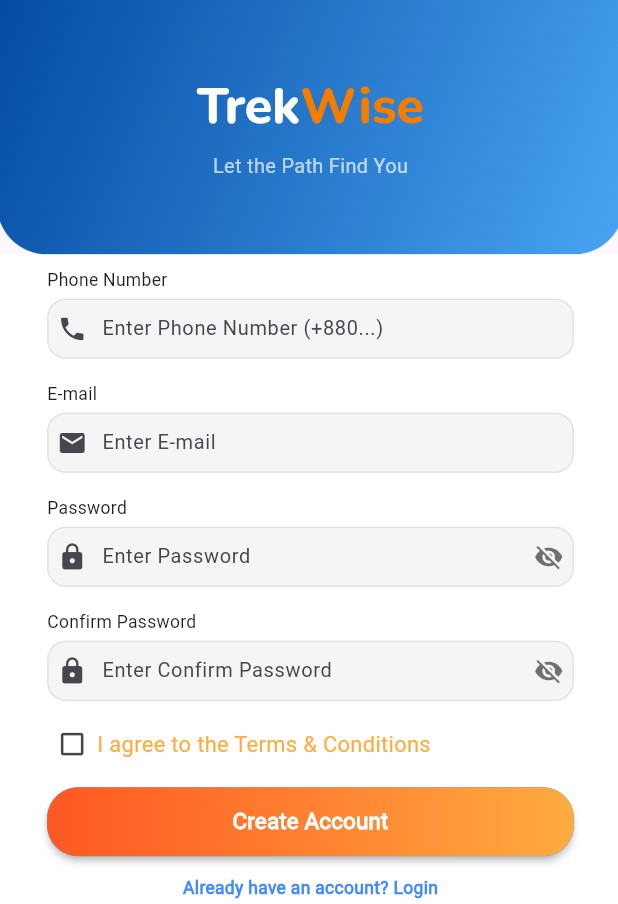
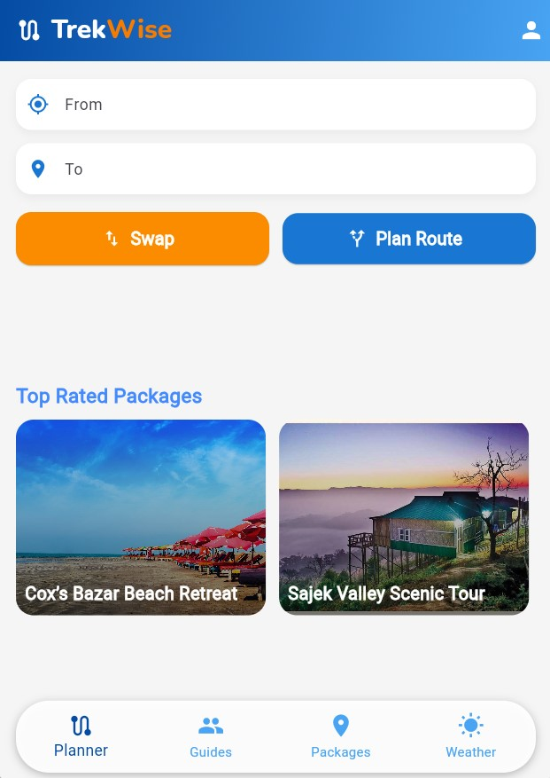
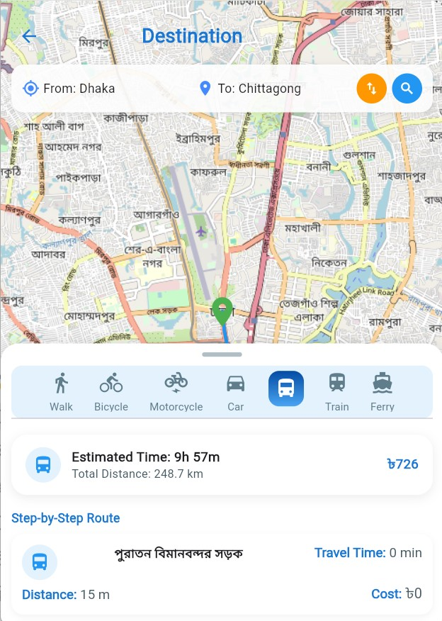
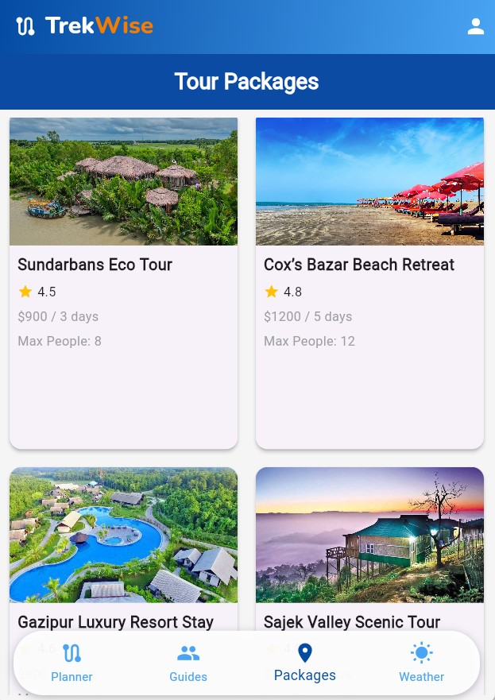
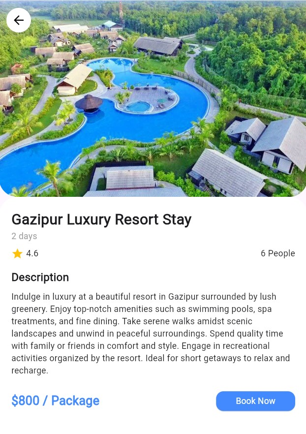
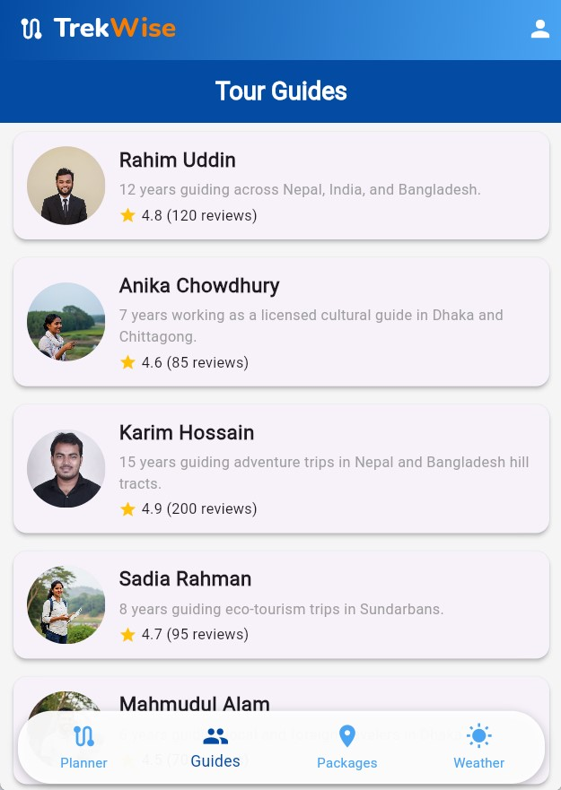
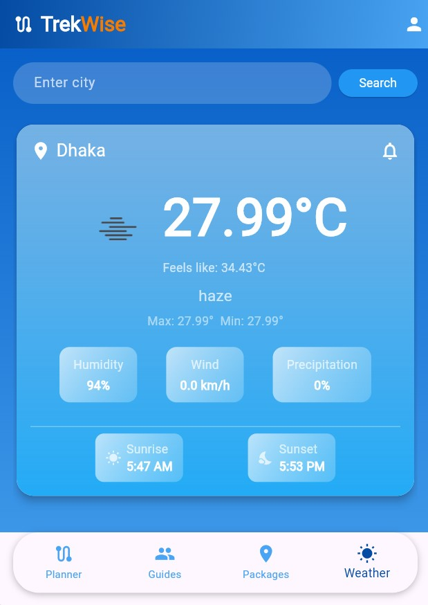
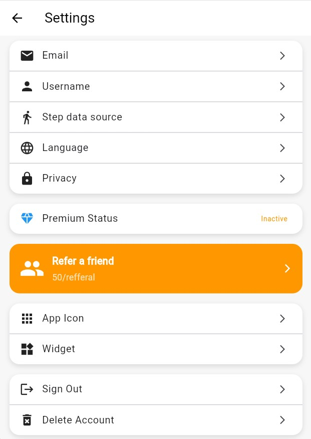

# TrekWise

TrekWise is a smart, cross-platform **travel planner** and **guide-finder app** built with **Flutter** and **Firebase**, designed to help travelers in developing regions **plan safe, affordable, and efficient trips**.

---

## Overview

**TrekWise** is a travel companion app that simplifies **trip planning**, **route selection**, and **local guide discovery**.  

Optimized for regions like **Bangladesh**, where transport systems are fragmented, the app integrates:

- **Real-time route data** to find the best travel options  
- **Verified local guides and packages** for safe and authentic experiences  
- **Travel cost estimations** to help users plan within their budget  
- **Real-time weather updates and alerts** to ensure safe and informed travel  

By combining these features, TrekWise provides a **seamless, reliable, and budget-friendly** travel experience for daily commuters, tourists, and budget-conscious travelers.

---

## Key Features

- **Smart Route Planning**               : Compare travel options — fastest, cheapest, or most convenient.  
- **Expense Tracker**                    : Estimate trip costs and manage travel budgets.  
- **Verified Local Guides & Packages**   : Connect with trusted, community-verified services.  
- **Real-Time Weather & Alerts**         : Stay informed with live forecasts and travel advisories.  
- **Offline Route Access**               : Save and view routes even without internet.  
- **Cross-Platform Support**             : Fully compatible with Android and iOS.

---

## Tech Stack

| Category       | Technology |
|----------------|------------|
| **Language**   | Dart |
| **Framework**  | Flutter |
| **Backend**    | Firebase (Authentication, Firestore, Storage) |
| **APIs**       | OpenStreetMapRoute API, OpenWeatherMap API |
| **IDE**        | Android Studio / VS Code |
| **Platform**   | Android & iOS |

---

## Installation & Setup

### Prerequisites

Before running the app, ensure you have the following installed:

- [Flutter SDK](https://flutter.dev/docs/get-started/install)  
- [Android Studio](https://developer.android.com/studio) or [VS Code](https://code.visualstudio.com/)  
- A connected **Android** or **iOS** device, or a compatible emulator

### Steps

1. **Clone this repository**
   ```bash
   git clone https://github.com/AimanCrafts/TrekWise.git

2. **Navigate to the project folder**
   ```bash
   cd TrekWise

3. **Get the dependencies**
   ```bash
   flutter pub get

4. **Run the app**
   ```bash
   flutter run

---

## App Flow

```text
Home Screen
      ↓
Destination Input
      ↓
Route Suggestions (multi-modal options)
      ↓
Expense Tracker
      ↓
Save Route / Book Packages / View Weather Alerts
```

---

## Screenshots

<div align="center">
<h3 style="font-weight:bold; margin-bottom:15px;">Authentication</h3>
<table border="0" cellspacing="0" cellpadding="15">
  <tr>
    <th>Log In</th>
    <th>Create Account</th>
  </tr>
  <tr>
    <td align="center">
      
    </td>
    <td align="center">
      
    </td>
  </tr>
</table>
</div>

<div align="center">
<h3 style="font-weight:bold; margin-bottom:15px;">Main Screens</h3>
<table border="0" cellspacing="0" cellpadding="15">
  <tr>
    <th>Home Page</th>
    <th>Route Comparison</th>
    <th>Tour Package</th>
  </tr>
  <tr>
    <td align="center">
      
    </td>
    <td align="center">
      
    </td>
    <td align="center">
      
    </td>
  </tr>
</table>
</div>

<div align="center">
<h3 style="font-weight:bold; margin-bottom:15px;">Details & Info</h3>
<table border="0" cellspacing="0" cellpadding="15">
  <tr>
    <th>Package Details</th>
    <th>Tour Guide</th>
    <th>Tour Guide Details</th>
  </tr>
  <tr>
    <td align="center">
      
    </td>
    <td align="center">
      
    </td>
    <td align="center">
      
    </td>
  </tr>
</table>
</div>

<div align="center">
<h3 style="font-weight:bold; margin-bottom:15px;">Utilities & Settings</h3>
<table border="0" cellspacing="0" cellpadding="15">
  <tr>
    <th>Real-time Weather</th>
    <th>Settings</th>
  </tr>
  <tr>
    <td align="center">
      
    </td>
    <td align="center">
      
    </td>
  </tr>
</table>
</div>


---

## Project Goals

- Optimize travel efficiency with **smart route suggestions**.  
- Promote **domestic tourism** through verified local guides.  
- Enable **offline access** for low-connectivity areas.  
- Ensure **safe and transparent** travel experiences for all users.  

---

## Challenges

- Integrating multiple APIs (**Maps, Weather, Guides**) seamlessly.  
- Optimizing app performance across **Android and iOS**.  
- Designing an **intuitive, modern UI** for first-time users.  
- Maintaining **real-time updates** in low-network environments.  

---

## Future Enhancements

- **Multi-language Support** — Expand accessibility across regions.  
- **Community Reviews & Tips** — Allow travelers to share insights and feedback.  
- **Transport Provider Integration** — Enable direct ticket and package bookings.  
- **AI-Powered Optimization** — Recommend routes and cost breakdowns intelligently.  
- **Regional Expansion** — Extend coverage to more developing regions with similar transport challenges.  

---

## Team

| Name                    | Role                         |
|-------------------------|-------------------------------|
| **Abdur Rahman Aiman**  | Lead Developer & UI Designer |
| **Munawar Mahtab Moon** | Backend Developer (Firebase) |
| **Raisul Islam Sifat**  | API Integration & Testing    |

---

## License

It is licensed under the [MIT License](LICENSE).

